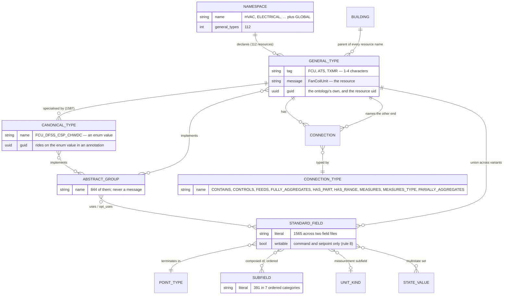

# modules/

Every upstream this repository reads, and nothing it writes. One submodule
today: `digitalbuildings`, Google's ontology, pinned by `sync/spec.yaml`.

This file is a reader's map of what is actually in there — the seven facets,
the YAML shapes each one uses, and how a directory of hand-maintained YAML
becomes 112 resources. `docs/spec.md` is the pin's history and the procedure
for moving it; this is what the pin points at.

Nothing here is edited. A change to the ontology is made upstream and arrives
by moving the submodule; a change to how the ontology is *read* is made in
`sync/`. There is no third option, and a local edit under `modules/` is
reverted by the next `git submodule update` without saying so.

## Read it with the tool, not by grepping

```sh
just erd                             # every namespace, resources collapsed
just erd electrical                  # one namespace, general types and variants
just erd electrical/generator        # one resource, in full
just erd -view objects               # the primary objects and their relations
just erd -view mermaid hvac          # the same, as a Mermaid erDiagram
```

`sync/cmd/erd` reads this directory and never `protobuf/`. That is deliberate:
a view built by re-reading the emitted schema would agree with the schema by
construction, and so could not show that the schema says something the
ontology does not. Every count in this file was measured against this checkout rather than
carried over from prose, and most of them came out of `erd` itself.

`just survey` is the other half — the per-facet census, to be read after a
spec bump before anything is regenerated.

## The pin

```yaml
# sync/spec.yaml
ontology:
  repository: https://github.com/google/digitalbuildings
  commit: 4a794acf6f01faa88a61f3740bf8d10dacee2483
  date: 2026-09-09
  path: ontology/yaml/resources
```

`just spec` checks the pin against this checkout — commit, date, and a clean
tree — because a stale pin puts a revision into every generated banner that
the files were never generated from, and nothing else can see that is false.

## What is in the submodule

Only one path is an input. The rest is upstream's own tooling and prose, and
the generator does not read a byte of it.

| Path | Read by `sync` | What it is |
| --- | --- | --- |
| `ontology/yaml/resources/` | **yes, all of it** | the vocabulary: seven facets, 122 YAML files |
| `ontology/docs/` | no | upstream's prose. `model.md` is the authority for rule 7, `ontology.md` for rules 5, 12 and 13 |
| `ontology/rdf/` | no | an RDF rendering of the same model |
| `tools/`, `ibr/`, `styles/` | no | upstream's Python validator, the IBR format, lint config |

## The seven facets

`ontology/yaml/resources/` is seven facets in three shapes. The parser handles
each separately rather than generically, because the input is a
hand-maintained corpus under continuous change and a reader that quietly
accepts an unfamiliar shape produces a schema that is wrong in a way no linter
catches (rule 15).

| Facet | Path | Count | Shape |
| --- | --- | --- | --- |
| subfields | `subfields/subfields.yaml` | 391 in 7 categories | category → literal → definition |
| fields | `fields/telemetry_fields.yaml`, `fields/metadata_fields.yaml` | 1,565 (1,540 + 25) | a list under `literals:`, three value shapes |
| states | `states/states.yaml` | 67 | flat map, literal → definition |
| units | `units/units.yaml` | 69 kinds, 191 names | map of maps — **and five bare strings** |
| connections | `connections/connections.yaml` | 9 | map, name → `{description}` |
| entity types | `<NS>/entity_types/*.yaml`, `entity_types/*.yaml` | 2,637 | map, name → declaration |
| namespaces | the directory names themselves | 13, plus global | — |

### subfields — the field grammar

Seven categories, and **the order they appear in the file is the grammar**:

```text
aggregation_descriptor → aggregation → descriptor → component →
measurement_descriptor → measurement → point_type
```

| Category | Count | Examples |
| --- | --- | --- |
| `aggregation_descriptor` | 3 | `fivesecondrolling`, `tenminutefixed` |
| `aggregation` | 5 | `average`, `max`, `min`, `total` |
| `descriptor` | 217 | `discharge`, `zone`, `chilled`, `exhaust` |
| `component` | 41 | `fan`, `pump`, `coil`, `battery`, `damper` |
| `measurement_descriptor` | 42 | `run`, `linear`, `differential` |
| `measurement` | 69 | `temperature`, `pressure`, `flowrate` |
| `point_type` | 14 | `sensor`, `command`, `setpoint`, `alarm`, … |

A field literal is those subfields concatenated in that order, and the
terminating `point_type` is what rule 8 reads to decide whether anything may
write the field:

```text
discharge_air_temperature_sensor
  discharge  descriptor
  air        descriptor
  temperature  measurement  → the quantity kind, and so the standard unit
  sensor     point_type     → OUTPUT_ONLY

exhaust_fan_run_command
  exhaust    descriptor
  fan        component
  run        measurement_descriptor
  command    point_type     → OPTIONAL, writable
```

The ontology is explicit that **the subfield set is the field's identity, not
the name**: `zone_air_temperature_sensor` and `air_zone_temperature_sensor`
are the same field. A proto field name has thrown that set away, which is the
whole argument for the annotation vocabulary of rule 5.

### fields — three value shapes under one list

```yaml
literals:
- manufacturer_label                    # bare: 10 of them, a string
- air_pressure_sensor:                  # numeric: 953
    flexible_min: 500.0
    flexible_max: 200000.0
- air_pressure_status:                  # multistate: 602
  - ACTIVE
  - INACTIVE
```

Which of the three decides the proto type, and the two bound kinds are **not
the same claim**. `fixed_*` is a constraint and becomes a `buf.validate` rule;
`flexible_*` is an expectation and becomes a comment and an annotation, never
a rule. A sensor reading outside its flexible range is a fault to report, not
a message to reject — see rule 13.

19 of the numeric literals name no measurement subfield. They have no quantity
kind and so no unit, and are integers rather than quantities.

The split between the two files is rule 8's whole answer:
`metadata_fields.yaml` is configuration (`OPTIONAL` + `IMMUTABLE`), and in
`telemetry_fields.yaml` the point type decides — `command` and `setpoint` are
writable, the other twelve are `OUTPUT_ONLY`.

### states — and the YAML 1.1 trap

```yaml
ON: "Powered on."
OFF: "Powered off."
```

Unquoted. A **YAML 1.1** reader resolves those keys to the booleans `true` and
`false`, and the ontology's two commonest states — 111 fields' worth — arrive
named `True` and `False`, compiling into a perfectly valid and entirely wrong
enum. `gopkg.in/yaml.v3` follows the YAML 1.2 core schema and tags them
`!!str`; `yaml.v2` does not, and neither does a decode into `map[any]any`.
`sync/ontology` reads through `yaml.Node` and checks the tag so the reliance
is explicit, and `TestStatesAreNotBooleans` pins it.

602 multistate fields draw on only **40 distinct state sets**, so the schema
gets 40 shared enums rather than 602. Three sets cover 528 fields on their
own: `ACTIVE`/`INACTIVE`, `OPEN`/`CLOSED`, `ON`/`OFF`.

### units — two value shapes under one key

```yaml
temperature:                 # a map: unit name → STANDARD, or a conversion
  kelvins: STANDARD
  degrees_celsius: {multiplier: 1, offset: 273.15}
diameter: distance           # a bare string naming another kind
```

Five keys are aliases rather than maps: **`diameter`, `length`, `level`,
`linearacceleration`, `massconcentration`**. A reader expecting a map gets a
string, which is a panic or a silently empty unit set depending on how it
decodes — both wrong answers rather than errors.

> `docs/conventions.md` rule 13 and `docs/generator.md` both list `impulse` as
> the fifth alias. It is not one: `impulse` is a real kind with
> `newton_seconds: STANDARD`, and it sits one line below `level: distance` in
> the file. The fifth alias is `massconcentration`. The parser derives the set
> rather than listing it, so the code is right and only the prose is wrong.

Every kind has exactly one `STANDARD`. The standard unit is pinned into the
field's annotation and restated in its comment; it is **not** put on the wire
beside the value, because two producers of the same field could then disagree
about what the number means.

### connections — the ERD's only true edges

Nine, and each is instance-level: a building config asserts them between
entities, and no entity type declares which it accepts.

`CONTAINS` · `CONTROLS` · `FEEDS` · `FULLY_AGGREGATES` · `HAS_PART` ·
`HAS_RANGE` · `MEASURES` · `MEASURES_TYPE` · `PARIALLY_AGGREGATES`

`PARIALLY_AGGREGATES` is an upstream typo for "partially". It is kept verbatim
because it is the wire value, and correcting it here would desynchronise this
schema from every config written against the ontology.

### entity types — four levels, and rule 7 cuts between two of them

This is the facet that decides the shape of the schema.

```text
namespace         ELECTRICAL              13 of them, plus global
  general type    ATS                     ── the resource: one message,
                                             one service, one package
    canonical     ATS_SRC1_SRC2           ── an enum value on that resource
    abstract      SS, IOBM, PWM, SRC1     ── a functional group: fields only,
                                             never a message
```

| Flag | Count | Becomes |
| --- | --- | --- |
| `is_abstract: true` | 844 | nothing on its own; its fields flow into whatever implements it |
| `is_canonical: true` | 1,587 | an enum value, carrying its exact field sets in an annotation |
| declared in `GENERALTYPES.yaml` | 82 with variants | a resource — the message |
| neither flag | 206 | see **What the generator drops**, below |

A canonical type's general type is its name up to the first `_`, cross-checked
against the namespace's `GENERALTYPES.yaml`. That prefix is a *convention*,
not a rule the ontology enforces, and one type breaks it:
`ELECTRICAL/SWITCHBOARD` is canonical and implements `PANEL`. Walking
`implements` to a declared general type is the fallback, and it is not a guess
— it is the ontology stating the relationship outright, which is better
evidence than the name.

#### The file names inside `entity_types/` are a convention

| File | What it holds |
| --- | --- |
| `GENERALTYPES.yaml` | the namespace's general types — the resources |
| `ABSTRACT.yaml` | functional groups: `SS`, `IOBM`, `PWM`, `RMM` |
| `<TAG>.yaml` | the canonical variants of one general type: `ATS.yaml`, `FCU.yaml` |
| `INITIAL.yaml` | onboarding placeholders, `allow_undefined_fields: true`, explicitly "not to be permanently applied" |
| `ANALYSIS.yaml` (HVAC) | completeness tags: `CONTROL`, `OPERATIONAL` |
| `LOADTYPES.yaml` (METERS) | what a meter measures: `LOADTYPE_MAIN`, `LOADTYPE_PLUG` |
| `entity_types/global.yaml` | the global namespace — see below |
| `<Namespace>.yaml` | a namespace with no general types keeps everything in one file: `Facilities.yaml`, `Carson.yaml` |

Three declaration sites have to be recognised, and only the first is obvious:

1. **`GENERALTYPES.yaml`**, in the eight namespaces that have one: `ELECTRICAL`
   `GATEWAYS` `HVAC` `LIGHTING` `METERS` `PLUMBING` `SAFETY` `TRANSPORT`.
2. **`entity_types/global.yaml`**, which is *not* called `GENERALTYPES.yaml`
   and mixes `PMP`, `SENSOR`, `TK`, `VLV` and `USER_INTERFACE` in with
   `EQUIPMENT` itself and four markers that are not equipment at all
   (`NO_ANALYSIS`, `DEPRECATED`, `REMAP_REQUIRED`, `INCOMPLETE`). Taking the
   whole file would make `EQUIPMENT` a general type and every canonical type
   in the ontology would partition onto it. The discriminator there is
   inheritance, not position: a general type implements `EQUIPMENT` and a
   marker does not.
3. **A namespace with no `GENERALTYPES.yaml` at all** — `CARSON`,
   `FACILITIES`, `INFO_TECH`, `PHYSICAL_SECURITY`, `UNTYPED`. There the entity
   types *are* the resources: `BUILDING`, `FLOOR`, `ROOM`, `DOOR`. This is not
   cosmetic — `PHYSICAL_SECURITY/DOOR_STD` is canonical and implements
   `FACILITIES/DOOR`, so without it a cross-namespace general type is
   invisible and two canonical types cannot be placed.

#### `implements` is a DAG, and resolution is namespaced

```yaml
ATS_SRC1_SRC2:
  guid: "2b385a36-ee72-49ba-9d12-6731c9c502c1"
  description: "Standard automatic transfer switch."
  is_canonical: true
  implements: [ATS, SRC1, SRC2]     # bare: this namespace, then global
  uses:      [master_mode, control_mode, switch_position_mode]
  opt_uses:  [generator_status, fire_alarm]
```

- a **bare** name resolves in the referring namespace, then falls back to global
- a **`/`-prefixed** name is explicitly global: `/SS`, `/EQUIPMENT`
- **`NS/NAME`** is explicit: `CARSON/COORDINATE_BASIS`, `FACILITIES/DOOR`

A type reaches `EQUIPMENT` by several paths, so resolution follows a DAG with
sharing and reports a cycle rather than following it. The resolved field set
is flat, and a resource carries the **union** across all its variants — every
field `optional`, because no variant has them all.

Every entity type carries a `guid`, and it is stable across upstream renames.
That is why catalogue entries for entity types are keyed by GUID and not by
name, and why a resource's `uid` **is** the ontology's GUID rather than a
second identifier invented beside it.

## The entity-relationship model

What the ontology itself is shaped like — `just erd -view mermaid`:



Two edges in that drawing are not fields, and cannot be. AIP-215 forbids a
field from referencing a message in another proto package, so a `Connection`
carries a type and the *resource name* of the other end, with
`(google.api.resource_reference).type = "*"`. A floor does not hold its fan
coil units.

## Worked example: ELECTRICAL, end to end

`just erd electrical`:

| Tag | Message | Variants | Fields | Package segment |
| --- | --- | --- | --- | --- |
| `ATS` | `AutomaticTransferSwitch` | 2 | 28 | `automatic_transfer_switch` |
| `BATT` | `Battery` | 0 | 2 | `battery` |
| `CB` | `CircuitBreaker` | 1 | 7 | `circuit_breaker` |
| `PANEL` | `ElectricalPanel` | 1 | 4 | `electrical_panel` |
| `GEN` | `Generator` | 2 | 32 | `generator` |
| `TXMR` | `Transformer` | 1 | 7 | `transformer` |
| `UPS` | `UninterruptiblePowerSupply` | 7 | 61 | `uninterruptible_power_supply` |

Following `ATS` all the way down:

```text
ELECTRICAL/                                   the namespace
  GENERALTYPES.yaml                             declares ATS, is_abstract
    ATS  "Tag for automatic transfer switch (ATS) units."
  ATS.yaml                                      declares its canonical types
    ATS_SRC1_SRC2  implements [ATS, SRC1, SRC2]
    ATS_SPM        implements [ATS, SPM]
  ABSTRACT.yaml                                 declares the groups they mix in
    SRC1  "Source 1 parameters typically for ATS"
    SRC2  "Source 2 parameters typically for ATS"
    SPM   "ATS switch position monitoring."
```

becomes

```text
protobuf/digitalbuildings/electrical/automatic_transfer_switch/v1/
  automatic_transfer_switch.proto        message AutomaticTransferSwitch
  automatic_transfer_switch_type.proto   enum    AutomaticTransferSwitchType
                                                   …_ATS_SRC1_SRC2
                                                   …_ATS_SPM
  service.proto                          service AutomaticTransferSwitches
  messages.proto                         the six requests and responses
  connection.proto, link.proto, …        the value types, copied per package
  <state set>_value.proto                one file per shared multistate enum

  package protobuf.digitalbuildings.electrical.automatic_transfer_switch.v1
  name    buildings/{building}/automaticTransferSwitches/{automatic_transfer_switch}
```

The directory segment is the English name, not the ontology tag.
`electrical/ats` is unreadable to anyone who does not already know the
ontology, and a directory name is the first thing a consumer sees — before any
comment, annotation or README. The tag is not lost: it is on the message, in
`(annotations.entity_type).name`, which is where a program looks for it.

The 28 fields on the message are the union of what both variants reach through
`implements` — `SRC1` and `SRC2` contribute the `source1_*` and `source2_*`
families, `EQUIPMENT` contributes `manufacturer_label` and `model_label`. Two
of the 28 are writable; the other 26 terminate in a read-only point type.

## What the ontology carries per namespace

| Namespace | Resources | Variants | Fields | Largest resource |
| --- | --- | --- | --- | --- |
| `hvac` | 46 | 1,392 | 4,020 | `AirHandlingUnit` (450) |
| `safety` | 17 | 30 | 77 | `LeakDetectionSystem` (16) |
| `lighting` | 9 | 45 | 76 | `LuminaireGroup` (29) |
| `electrical` | 7 | 14 | 141 | `UninterruptiblePowerSupply` (61) |
| `facilities` | 7 | 2 | 2 | `Door` (2) |
| `physical_security` | 7 | 0 | 0 | `BadgeReader` (0) |
| `meters` | 6 | 27 | 100 | `ElectricalMeter` (43) |
| `global` | 5 | 72 | 286 | `Sensor` (113) |
| `plumbing` | 3 | 3 | 18 | `WasteCompactor` (7) |
| `transport` | 1 | 2 | 13 | `Elevator` (13) |
| `carson`, `gateways`, `info_tech`, `untyped` | 1 each | 0 | 0 | — |
| | **112** | **1,587** | **4,733** | |

The distribution is the thing to take away: HVAC is 88% of the canonical types
and 85% of the fields. A change to `HVAC/AHU.yaml` is a large diff; a change
to `CARSON/Carson.yaml` is not.

## What the generator drops

206 entity types carry neither `is_abstract` nor `is_canonical`. 17 are in the
five namespaces with no `GENERALTYPES.yaml`, where they become resources. The
other **189 are in namespaces that do declare general types, and the partition
has no slot for them**. 12 are still reached — something `implements` them, so
their fields flow into whatever does. The remaining 177 are unreachable, and
124 of those declare fields of their own.

| Group | All 189 | Unreachable | …declaring fields |
| --- | --- | --- | --- |
| `*NONCANONICAL*`, `*NON_CANONICAL*` | 112 | 111 | 108 |
| unflagged, otherwise ordinary | 51 | 40 | 16 |
| `*_INITIAL` | 22 | 22 | 0 |
| `*_UNDEFINED` | 4 | 4 | 0 |

The first group is upstream saying outright that this is not a standard type,
and dropping it is right. `*_INITIAL` are onboarding placeholders carrying
`allow_undefined_fields: true` and the comment "not to be permanently applied
to entities"; they declare no fields and dropping them is right too, as is
`*_UNDEFINED`.

**The second group is the one that matters**, and `ELECTRICAL/BATT_STD` is the
clearest case:

```yaml
BATT_STD:
  guid: "d5b5721e-1194-4b1b-8e0e-ed24bc1fab70"
  description: "Standard battery."
  implements: [BATT]
  uses:     [voltage_sensor, current_sensor]
  opt_uses: [remaining_charge_time_sensor, battery_charge_status, …]
```

No `is_canonical: true`, so `Battery` is emitted with **no type enum at all
and two fields** — `manufacturer_label` and `model_label`, inherited from
`EQUIPMENT` — while the ontology describes a standard battery with eleven.
`ELECTRICAL/UPS_UPSTR` is the same shape and says `is_canonical: false`
outright; `METERS/EM_ION`, `HVAC/ZONE_HVAC`, `HVAC/HUM_RHHC`,
`LIGHTING/LTGW_BS` and the eight `HVAC/DWST_*` types are others. The largest
by declared fields is `HVAC/FCU_RHC_DFVSC_RTC` at 14.

A third slice of that group is 11 types sitting in `HVAC/ABSTRACT.yaml`
without `is_abstract: true` — `BSWTC`, `SSWTC`, `SRWISOVM` and so on. Those
are reached, because other types implement them, so nothing is lost today; the
flag is missing rather than the type.

This is a live decision, not a defect to patch quietly. Rule 15 says the
generator fails loudly or not at all, and a type matching no branch of the
partition is currently ignored rather than reported. Settling it means
choosing, per group, between *drop and say so*, *treat as canonical*, and
*error until a catalogue entry says which* — and then having
`sync/model/partition.go` enforce the choice rather than fall through.

## Bumping the pin

The procedure is `docs/spec.md`. In short: move the submodule, edit
`sync/spec.yaml`, `just spec`, **`just survey` and `just erd` before
regenerating**, then `just sync` and read `git diff --stat protobuf/`.

What a bump can break, in the order it will bite you:

- **a catalogue entry that no longer applies** — a build error by design
  (`model.CheckCatalogue`). Entity-type entries are keyed by GUID and survive
  an upstream rename; field, state and unit entries are keyed by the literal
  and do not.
- **a field number that moved** — the failure this repository most needs to
  catch, and the one `buf breaking` cannot see, because both sides of a
  comparison between regenerated trees are internally consistent.
  `sync/ordinals.yaml` is what sees it. The ontology inserts new fields
  *alphabetically* into existing `uses` lists, so numbering by position would
  renumber half of a 450-field message on a routine bump.
- **a general type gaining its first canonical variant** — a new resource,
  package, service and directory. Not a break, but a much larger diff than the
  commit range suggests.
- **a general type losing its last variant** — removes a package. An empty
  package is still a published import path: deprecate, do not delete.
- **a new state in an existing multistate set** — changes a shared enum, and
  by rule 13 that enum is shared across every field using the set. A one-line
  ontology change can touch hundreds of fields. Additions are wire-safe;
  confirm the diff is only additions.
- **a new subfield category or point type** — the one that needs thought
  rather than procedure. The category order *is* the field grammar, and a new
  point type has to be classified writable or read-only under rule 8 before
  anything will build.

## Upstream, for reading

- [Ontology concepts](https://github.com/google/digitalbuildings/blob/master/ontology/docs/ontology.md)
  — subfields, the field grammar, equivalence, enumeration, multistates
- [Abstract model](https://github.com/google/digitalbuildings/blob/master/ontology/docs/model.md)
  — general types, abstract functional groups, canonical types
- [Ontology configuration](https://github.com/google/digitalbuildings/blob/master/ontology/docs/ontology_config.md)
  — the YAML file formats this page describes
- [Building configuration](https://github.com/google/digitalbuildings/blob/master/ontology/docs/building_config.md)
  — translations, links, connections, INITIALIZE/UPDATE
